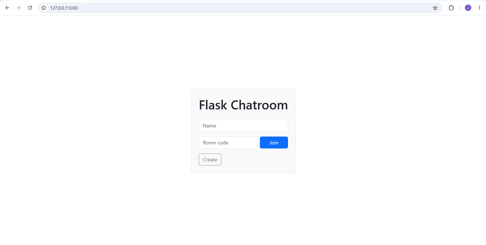
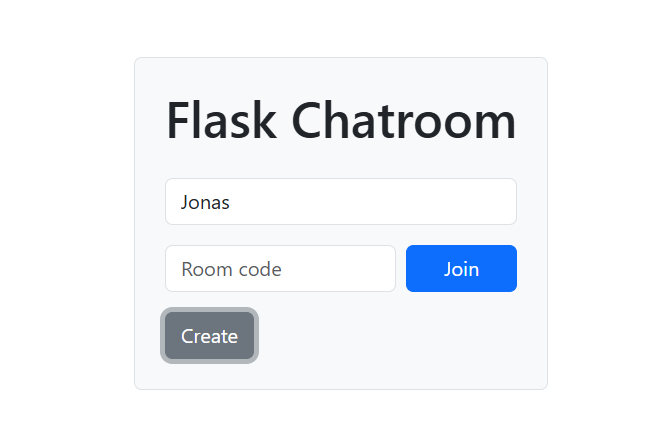
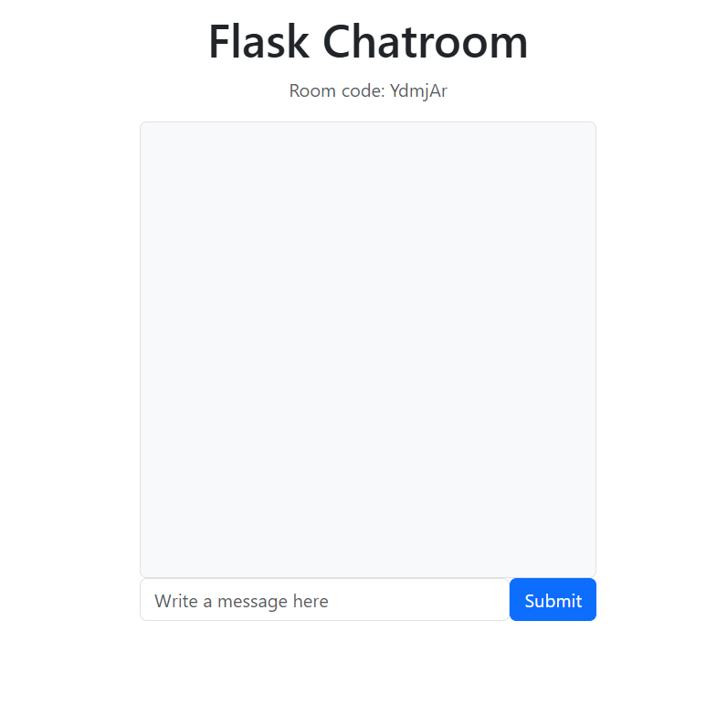
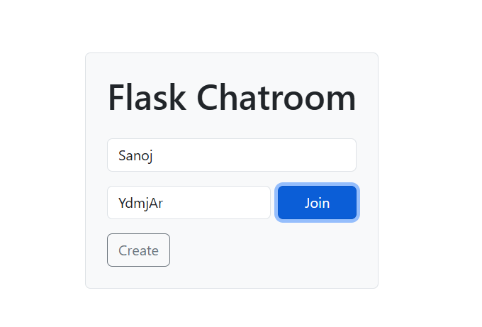
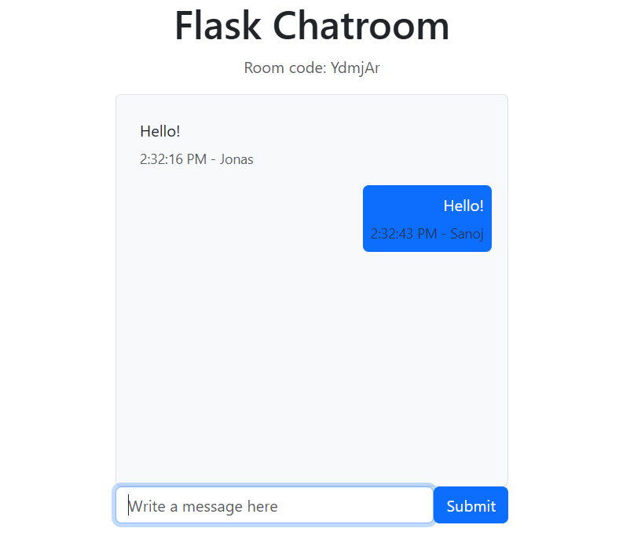

# FlaskChat

FlaskChat is a easy-to-use messaging app using Flask, SocketIO, SQLite and Jinja templates.

## Creating a Room

Enter your name, optionally choose a room code, and click Create.

  
  

After creating the room, you'll receive a unique room code to share.

  

---

## Joining a Room

Another user can join by entering the room code.

  
  

## Features include:
- unique user identification using uuid4
- real-time messaging with Flask-SocketIO
- reload-safe sessions
- room auto-cleanup when empty
- server-side message history saved in SQLite
- Minimal UI (Bootstrap based)

